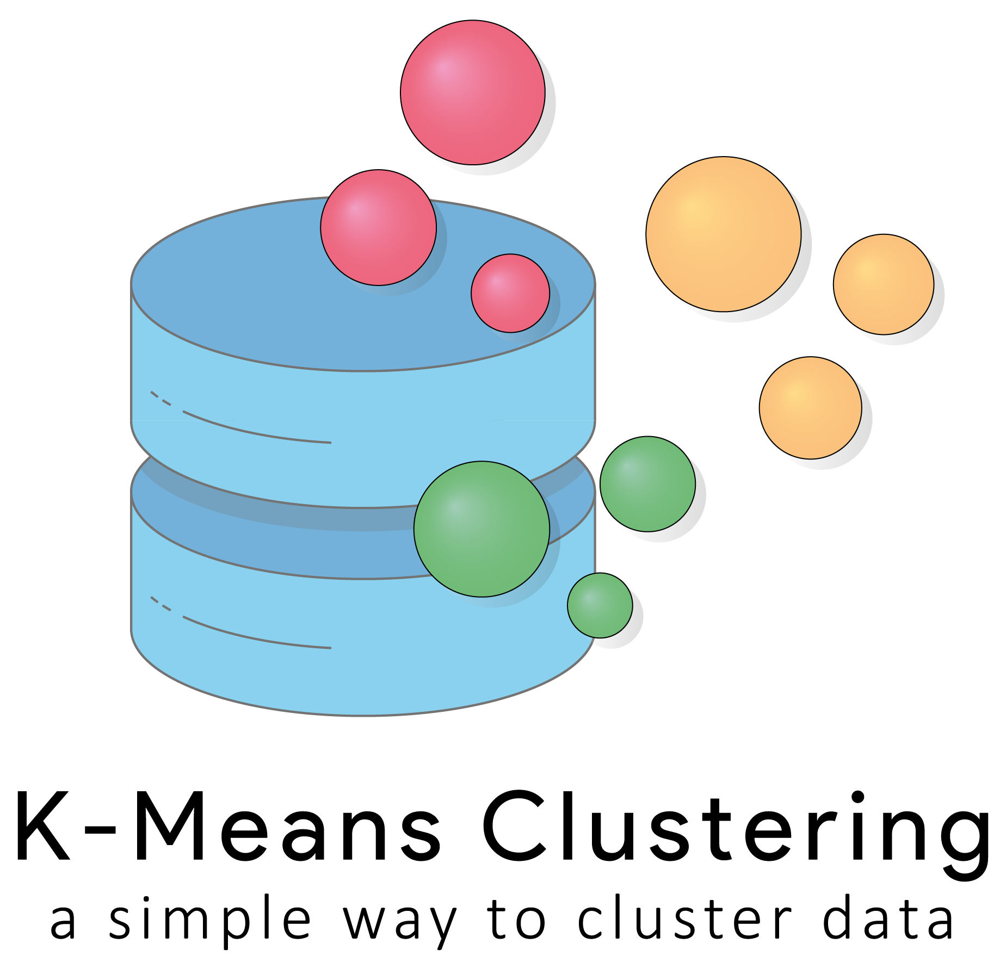

K-Means Clustering è un pacchetto di software, scritti in Java, che permette la clusterizzazione di esempi di dati a partire da una tabella di un database relazionale. Il pacchetto è composto da tre applicativi: un client console, un UI client e un server. 
